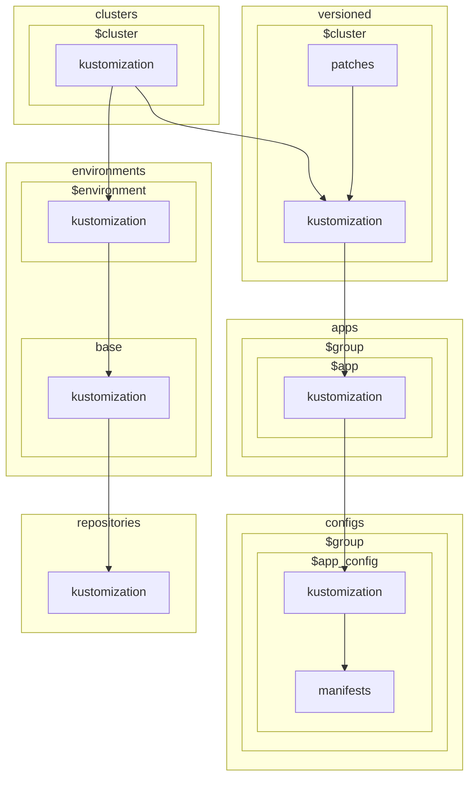

# Manifests

## GitOps using Flux and Renovate

### Overview

This repository serves as a complementary resource to the [anza-labs/infra](https://github.com/anza-labs/infra) repository, focusing on the deployment and management of applications in Kubernetes clusters. It contains a curated collection of applications packaged into kustomize configurations, which can be seamlessly deployed and managed using Flux, a GitOps tool that ensures your Kubernetes clusters are always in sync with your desired state as represented in Git.

The primary goal of this repository is to provide a streamlined and automated approach to managing Kubernetes applications. By leveraging GitOps principles, all changes to the cluster state are tracked and version-controlled, ensuring a clear audit trail and easy rollback if necessary. Flux continuously monitors your Git repository for changes and applies them to the cluster, making it a powerful tool for maintaining the desired state of your infrastructure.

### Automated Updates

Renovate is configured to automatically check for updates to dependencies. Refer to `renovate.json` for configuration details.

### License

This repository is licensed under the [The Unlicense](LICENSE). Feel free to modify and adapt it for your needs.

### Contribution

Feel free to contribute by opening issues or submitting pull requests. Your feedback and contributions are highly appreciated!
